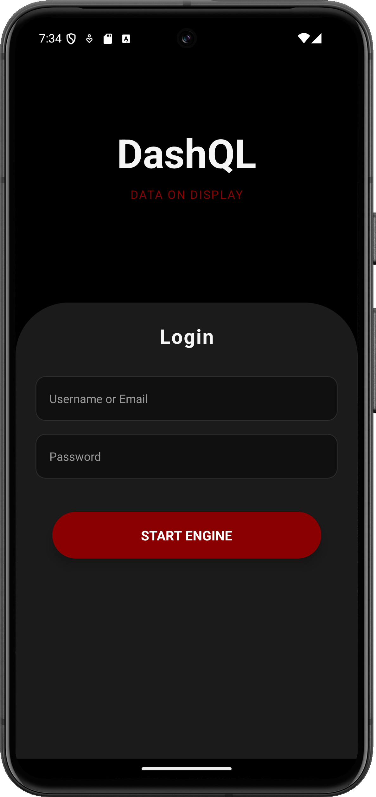
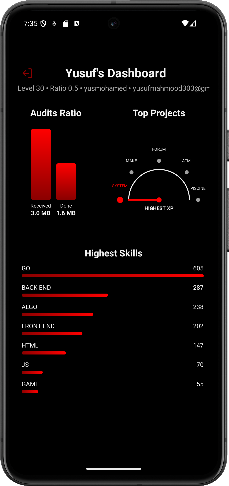

# 🚀 DashQL

**DashQL** is a cross-platform mobile dashboard application built with **React Native**, **Expo**, and **GraphQL**, designed to visualize user activity, skills, and audit data in a clean, interactive UI.

  
  

---

## 📱 Features

- 🔐 Authentication with persistent login
- 📊 Interactive graphs for audit ratios and project stats
- 🧠 Skill-level breakdowns with visual indicators
- ⚙️ Built with `expo-router` for smooth navigation
- 🎨 Utility-first styling via `twrnc` (tailwind-react-native-classnames)

---

## 🛠 Tech Stack

- **Expo SDK 52**
- **React Native**
- **TypeScript**
- **GraphQL**
- **expo-router**
- **twrnc** for styling (Tailwind CSS utility classes in RN)
